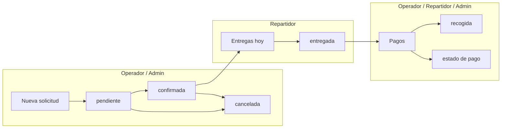

# LavaMax — Gestión de alquiler de lavadoras

Aplicación web para gestionar solicitudes de alquiler de lavadoras. Frontend en **HTML/CSS/JavaScript** (sin framework), despliegue en **GitHub Pages** y persistencia en **Google Sheets** mediante **Google Apps Script**, con **modo prueba** local en `localStorage`.

---

## Resumen de funcionalidades

| Área | Descripción |
|------|-------------|
| **Autenticación** | Ingreso con PIN por usuario; menú y rutas filtrados por rol |
| **Órdenes** | Listado filtrable con rango de fechas; stats superiores; cambio de gestión y edición |
| **Nueva solicitud** | Alta o edición de solicitudes; lavadora con autocompletado; cálculo automático del total |
| **Entregas hoy** | Órdenes con entrega programada para el día; tabs Por entregar / Entregadas |
| **Pagos** | Cobros del día y cartera activa; tabs Por cobrar / Ya pagadas; tarjeta Cobrado hoy |
| **Administración** | Inventario, tarifas, usuarios (PIN/rol), reportes financieros con filtros y cartera real |
| **Modo prueba** | Datos de ejemplo sin Google Sheets; PINs de demostración |

---

## Roles y casos de uso

Hay tres roles: `admin`, `operador` y `repartidor`. Cada uno ve solo las vistas de su rol en el menú lateral; si intenta abrir una ruta no permitida (por URL), la app redirige a su vista inicial.

### Matriz de acceso

| Vista / Ruta | Admin | Operador | Repartidor |
|---|:---:|:---:|:---:|
| Órdenes `#/` | ✓ | ✓ | — |
| Nueva solicitud `#/nueva` | ✓ | ✓ | — |
| Entregas hoy `#/entregas` | ✓ | — | ✓ |
| Pagos `#/pagos` | ✓ | ✓ | ✓ |
| Inventario `#/admin/inventario` | ✓ | — | — |
| Tarifas `#/admin/tarifas` | ✓ | — | — |
| Usuarios `#/admin/usuarios` | ✓ | — | — |
| Reportes `#/admin/reportes` | ✓ | — | — |
| Configuración API (menú) | ✓ | — | — |

**Vista inicial tras el login**

| Rol | Ruta por defecto |
|-----|------------------|
| Admin | `#/` (Órdenes) |
| Operador | `#/` (Órdenes) |
| Repartidor | `#/entregas` (Entregas hoy) |

### Casos de uso por rol

#### Administrador (`admin`)

- Revisar y filtrar órdenes con rango de fechas o por fecha de recogida; confirmar, cancelar o editar solicitudes en `pendiente` / `confirmada`.
- Crear solicitudes desde **Nueva solicitud** o desde el botón **Editar** en Órdenes.
- Supervisar entregas del día y el flujo de cobros en **Pagos**.
- Gestionar inventario de lavadoras, tarifas (12 h / 24 h) y usuarios con PIN y rol.
- Consultar reportes financieros por rango de fechas: ingresos cobrados, cartera por cobrar (solo órdenes `entregada`), conteo por tipo de pago.
- Configurar la URL del API y la clave admin de Google Apps Script.
- En modo prueba: restablecer datos de ejemplo desde la barra superior.

#### Operador (`operador`)

- **Órdenes**: por defecto muestra las del **día actual**; con filtros puede ver otros días, rangos de fecha o todas las fechas (**Limpiar fecha**). Orden por proximidad de entrega; estados `pendiente` / `confirmada` / `cancelada` y botón **Editar** solo en órdenes aún no entregadas.
- **Nueva solicitud**: registrar clientes, dirección, fecha/hora de entrega, lavadora disponible y tarifa.
- **Pagos**: ver y gestionar cobros de órdenes en ruta o recogidas con saldo pendiente; registrar `pago efectivo`, `pago transferencia` o `pago parcial` con monto; marcar `entregada` → `recogida` al cerrar la recogida.
- No ve **Entregas hoy** ni el módulo de administración.

#### Repartidor (`repartidor`)

- **Entregas hoy**: solo órdenes con `fecha_entrega` = hoy (excluye `cancelada` y `recogida`); tabs Por entregar / Entregadas; cambiar gestión entre `pendiente`, `confirmada` y `entregada`.
- **Pagos**: mismo flujo de cobro que el operador para órdenes en ruta o con saldo pendiente.
- No ve **Órdenes**, **Nueva solicitud** ni administración.

---

## Flujo operativo recomendado



1. **Operador** crea la solicitud y la deja en `pendiente` o `confirmada` (puede corregir datos con **Editar** mientras siga en esos estados).
2. **Repartidor** (o admin) en **Entregas hoy** marca `entregada` al instalar la lavadora.
3. **Operador o repartidor** en **Pagos** registra el pago y, al recoger, pasa a `recogida`.

---

## Módulo Órdenes

Vista principal para **admin** y **operador** (`#/`).

### Listado por defecto

Al entrar, el filtro viene con el **día en curso** y muestra solo órdenes cuya **fecha de entrega** coincide con hoy, ordenadas por proximidad de entrega. Las que vencen en menos de 24 h llevan badge **Pronto**.

### Filtros

| Filtro | Uso |
|--------|-----|
| **Estado** | Todos o un estado de gestión concreto |
| **Filtrar por fecha** | `Fecha de entrega` (por defecto) o `Fecha de recogida` |
| **Desde / Hasta** | Rango de fechas; viene con hoy/hoy al cargar |
| **Buscar cliente** | Nombre o teléfono (con debounce) |
| **Limpiar fecha** | Quita el rango y muestra órdenes de **todas** las fechas |

### Tarjetas de estadísticas (superiores)

Calculadas sobre el total de órdenes cargadas (no solo el rango filtrado):

- **Pendientes de entregar** — órdenes en `pendiente` o `confirmada`
- **Entregas hoy** — órdenes con `fecha_entrega` = hoy que no son `cancelada` ni `recogida`
- **Recogidas** — órdenes en estado `recogida`

### Acciones por orden

| Acción | Cuándo |
|--------|--------|
| **Cambiar estado** (selector) | Solo si `pendiente` o `confirmada` → `pendiente`, `confirmada` o `cancelada` |
| **Editar** | Misma condición: abre `#/nueva?id=<id>` |
| Badge de estado | Si está `entregada`, `recogida` o `cancelada`: sin selector; gestionar en Entregas o Pagos |

---

## Nueva solicitud y edición

| Modo | Ruta | Comportamiento |
|------|------|----------------|
| **Crear** | `#/nueva` | Formulario vacío; al guardar crea orden en `pendiente` y `pago pendiente` |
| **Editar** | `#/nueva?id=<id>` | Carga la orden existente; al guardar actualiza sin cambiar `estado`, `estado_pago` ni `monto_pagado` |

**Campos editables:** cliente, teléfono, dirección, fecha/hora de entrega, lavadora, periodos de alquiler, tarifa y notas. El total se calcula automáticamente (periodos × precio tarifa).

**Restricciones de edición:** solo órdenes en `pendiente` o `confirmada`. Si ya fue entregada, recogida o cancelada, la app muestra un aviso y no permite editar.

**Lavadora en edición:** si la lavadora asignada no está `disponible` en inventario, igual aparece en el selector para no perder la asignación.

---

## Módulo Entregas hoy

Vista para **admin** y **repartidor** (`#/entregas`). Carga solo órdenes con `fecha_entrega = hoy` que no sean `cancelada` ni `recogida`, ordenadas por hora de entrega.

### Tarjetas de estadísticas

- **Entregas hoy** — total de órdenes del día
- **Por entregar** — en estado `pendiente` o `confirmada`
- **Ya entregadas** — en estado `entregada`

### Tabs

| Tab | Contenido |
|-----|-----------|
| **Por entregar** | Órdenes en `pendiente` o `confirmada`; buscador por cliente, teléfono o lavadora |
| **Entregadas** | Órdenes en `entregada` hoy; mismo buscador |

### Acción por orden

Cada tarjeta tiene **Actualizar gestión** que abre un modal con selector `pendiente / confirmada / entregada`. Al confirmar el cambio a `entregada` muestra una confirmación específica: "¿Confirmar que la lavadora fue entregada al cliente?"

---

## Módulo Pagos

Vista para **admin**, **operador** y **repartidor** (`#/pagos`). Carga exclusivamente las solicitudes visibles para el día en curso: órdenes con **saldo pendiente** (de cualquier fecha) y órdenes cuyo cobro fue registrado **hoy**.

### Tarjetas de estadísticas (superiores)

| Tarjeta | Cálculo |
|---------|---------|
| **Por cobrar** | Suma de saldos pendientes de todas las órdenes activas con deuda |
| **Cobrado hoy** | Suma de montos cobrados con `fecha_pago` = hoy (o recogida hoy como respaldo). Sub-línea: "Hoy X · Anteriores Y" |
| **Pendientes de pago** | Cantidad de órdenes con saldo y `estado_pago = pago pendiente` |
| **Listos para recoger** | Órdenes en `confirmada` o `entregada` cuya hora de recogida ya pasó |

### Tabs

| Tab | Contenido |
|-----|-----------|
| **Por cobrar** | Órdenes con `saldo > 0`. Orden de prioridad: recogidas con saldo primero, luego entregadas, luego confirmadas; dentro de cada grupo por fecha de recogida ascendente |
| **Ya pagadas** | Órdenes con `saldo = 0` y cobro registrado **hoy** (no el historial completo) |

### Prioridad visual en "Por cobrar"

Las órdenes en estado `recogida` con saldo pendiente (pago parcial de días anteriores) aparecen **al inicio de la lista** con borde destacado y badge **Cobrar saldo**, independientemente de su fecha.

### Filtros en tab "Por cobrar"

| Filtro | Opciones |
|--------|---------|
| **Gestión** | Todas con saldo / `confirmada` / `entregada` / `recogida` |
| **Estado de pago** | Todos / `pago pendiente` / `pago efectivo` / `pago transferencia` / `pago parcial` |
| **Buscar** | Cliente, teléfono o código de lavadora |

### Modal "Actualizar estados"

Al pulsar en cualquier tarjeta se abre el modal con:

- **Resumen de la orden**: cliente, teléfono, dirección, recogida, lavadora, total y saldo actual
- **Selector gestión**: solo habilitado si el estado es `entregada` (puede cambiarse a `recogida`); en cualquier otro estado está bloqueado con un aviso
- **Selector estado de pago**: `pago pendiente`, `pago efectivo`, `pago transferencia`, `pago parcial`
- **Campo monto pagado**: aparece solo si se selecciona `pago parcial`; sugiere el valor previo o la mitad del total
- **Preview de cambios**: muestra en texto los cambios antes de confirmar
- Al guardar un pago, se registra automáticamente `fecha_pago = hoy` para las tarjetas y la lista de Ya pagadas

### Campo `fecha_pago`

Al registrar o actualizar cualquier estado de pago, la app guarda la fecha del día en curso en el campo `fecha_pago` de la solicitud. Esto permite que:

- La tarjeta **Cobrado hoy** solo cuente cobros del día
- La lista **Ya pagadas** solo muestre órdenes saldadas hoy
- Órdenes pagadas en días anteriores no "contaminen" las cifras del día actual

---

## Módulo Administración

Solo accesible para **admin**.

### Inventario (`#/admin/inventario`)

Tabla CRUD completa: formulario de alta/edición al inicio, botones Editar y Eliminar por fila.

| Campo | Valores |
|-------|---------|
| `codigo` | Código visible (ej. `LAV-01`) |
| `modelo` | Marca y modelo |
| `capacidad_kg` | Número |
| `estado` | `disponible` / `alquilada` / `mantenimiento` |

### Tarifas (`#/admin/tarifas`)

CRUD de tarifas. El precio se muestra formateado en COP.

| Campo | Valores |
|-------|---------|
| `nombre` | Nombre descriptivo |
| `horas_duracion` | `12` o `24` |
| `precio_dia` | Precio del período en COP |
| `descripcion` | Texto libre |

### Usuarios (`#/admin/usuarios`)

CRUD de usuarios. El PIN se muestra como `****` en la tabla.

| Campo | Valores |
|-------|---------|
| `nombre` | Nombre visible en la app |
| `email` | Correo |
| `rol` | `admin` / `operador` / `repartidor` |
| `pin` | 4–6 dígitos numéricos |
| `activo` | `si` / `no` |

### Reportes (`#/admin/reportes`)

Rango de fechas configurable (por defecto: primer día del mes hasta hoy). Botón **Generar**.

#### Tab "Cobros y pagos"

**Tarjetas de estadísticas:**

| Tarjeta | Cálculo |
|---------|---------|
| **Ingresos cobrados** | Suma de `montoCobrado` de todas las órdenes no canceladas del periodo |
| **Por cobrar** | Saldo pendiente solo de órdenes con gestión `entregada` |
| **Pend. de pago** | Cantidad de órdenes `entregada` con `estado_pago = pago pendiente` |
| **Efectivo** | Cantidad con `pago efectivo` |
| **Transferencia** | Cantidad con `pago transferencia` |
| **Parciales** | Cantidad con `pago parcial` |

> Las tarjetas **Por cobrar** y **Pend. de pago** solo incluyen órdenes con gestión `entregada`. Las órdenes `confirmada`, `recogida` o `pendiente` no se contabilizan en la cartera del reporte, para evitar inflar cifras de órdenes que aún no están activas o ya están cerradas.

**Filtros sobre la tabla:**

| Filtro | Opciones |
|--------|---------|
| **Estado de pago** | Todos o uno específico |
| **Gestión** | Todos (excluye cancelada) o uno específico |
| **Buscar cliente** | Nombre o teléfono |

Al cambiar cualquier filtro, las tres tarjetas superiores se recalculan dinámicamente sobre las filas visibles.

**Tabla de detalle:** Fecha, Cliente, Total, Cobrado, Saldo, Pago (badge), Gestión (badge).

#### Tab "Canceladas"

Tarjetas: Canceladas filtradas, Valor total filtrado, Total en período. Tabla: Fecha, Cliente, Teléfono, Total.

---

## Estados de una solicitud

La app maneja **dos ejes independientes**:

### Estado de gestión (`estado`)

| Valor | Significado |
|-------|-------------|
| `pendiente` | Solicitud registrada, sin confirmar |
| `confirmada` | Confirmada para entrega |
| `entregada` | Lavadora entregada al cliente |
| `recogida` | Lavadora recogida; ciclo cerrado |
| `cancelada` | Solicitud cancelada |

**Dónde se puede cambiar cada transición:**

| Vista | Transiciones permitidas |
|-------|-------------------------|
| **Órdenes** | `pendiente` ↔ `confirmada` → `cancelada` (solo mientras no está entregada) |
| **Entregas hoy** | `pendiente` ↔ `confirmada` → `entregada` |
| **Pagos** | Solo `entregada` → `recogida` (en el modal de pago) |

### Estado de pago (`estado_pago`)

| Valor | Descripción |
|-------|-------------|
| `pago pendiente` | Sin cobro registrado (valor por defecto) |
| `pago efectivo` | Cobrado en efectivo (total) |
| `pago transferencia` | Cobrado por transferencia (total) |
| `pago parcial` | Abono parcial; requiere campo `monto_pagado` |

El módulo `finanzas.js` normaliza aliases: `efectivo` → `pago efectivo`, `transferencia` → `pago transferencia`, `pendiente` → `pago pendiente`, etc. Los cálculos de saldo usan siempre el valor normalizado.

### Cálculo de recogida

`fecha_entrega + hora_entrega + horas_alquiler = fecha/hora de recogida`

Las órdenes en ruta cuya hora de recogida ya pasó aparecen con badge **Recoger ya** en Pagos y se cuentan en la tarjeta **Listos para recoger**.

---

## Modelo de datos

### Solicitudes

| Campo | Tipo | Descripción |
|-------|------|-------------|
| `id` | UUID | Generado automáticamente |
| `fecha_solicitud` | datetime | Cuando se creó |
| `cliente_nombre` | texto | Nombre del cliente |
| `cliente_telefono` | texto | Teléfono |
| `direccion` | texto | Dirección de entrega |
| `fecha_entrega` | `YYYY-MM-DD` | Fecha de entrega de la lavadora |
| `hora_entrega` | `HH:mm` | Hora de entrega |
| `lavadora_id` | FK | ID del inventario |
| `lavadora_codigo` | texto | Código visible (ej. `LAV-01`) |
| `dias_alquiler` | número | Periodos contratados |
| `horas_alquiler` | número | Horas totales = periodos × duración tarifa |
| `tarifa_id` | FK | ID de la tarifa |
| `total` | número COP | Precio total |
| `estado` | enum | Estado de gestión (ver tabla anterior) |
| `estado_pago` | enum | Estado de pago (ver tabla anterior) |
| `monto_pagado` | número | Abono parcial (solo si `pago parcial`) |
| `fecha_pago` | `YYYY-MM-DD` | Fecha en que se registró el cobro |
| `notas` | texto | Instrucciones libres |

### Inventario

| Campo | Valores |
|-------|---------|
| `id` | UUID |
| `codigo` | `LAV-01`, etc. |
| `modelo` | Marca y modelo |
| `capacidad_kg` | Número |
| `estado` | `disponible` / `alquilada` / `mantenimiento` |

### Tarifas

| Campo | Valores |
|-------|---------|
| `id` | UUID |
| `nombre` | Nombre descriptivo |
| `precio_dia` | COP |
| `horas_duracion` | `12` o `24` |
| `descripcion` | Texto libre |

### Usuarios

| Campo | Valores |
|-------|---------|
| `id` | UUID |
| `nombre` | Nombre visible |
| `email` | Correo |
| `rol` | `admin` / `operador` / `repartidor` |
| `pin` | 4–6 dígitos |
| `activo` | `si` / `no` |

---

## Autenticación (PIN)

1. Al abrir la app aparece el teclado numérico de PIN (4–6 dígitos).
2. El API valida el PIN contra la hoja **Usuarios** (`activo = si`).
3. La sesión se guarda en `sessionStorage` (se pierde al cerrar la pestaña).
4. **Cerrar sesión** en el pie del menú lateral.

### PINs de modo prueba (sin API configurada)

| Usuario | Rol | PIN |
|---------|-----|-----|
| Maria Admin | admin | `1111` |
| Ana Operadora | operador | `2222` |
| Carlos Repartidor | repartidor | `3333` |

---

## Arquitectura

```
GitHub Pages (index.html + js/)
        │
        ▼
Google Apps Script Web App  (/exec)
        │
        ▼
Google Sheets (Solicitudes, Inventario, Tarifas, Usuarios)
```

| Archivo | Rol |
|---------|-----|
| `js/app.js` | Router hash, sesión, navegación |
| `js/auth.js` | Roles, permisos, menú por rol |
| `js/api.js` | Cliente HTTP hacia el API / mock |
| `js/mock-data.js` | Datos locales y emulación completa del API |
| `js/estados.js` | Reglas de transición de estados de gestión |
| `js/finanzas.js` | Lógica de estados de pago y cálculos de cobro |
| `js/pagos-view.js` | Reglas específicas de la vista Pagos (cobro del día, filtro API) |
| `js/alquiler.js` | Cálculo de fechas de recogida, duración, urgencia |
| `js/solicitudes-filter.js` | Filtros y stats para la vista Órdenes |
| `js/sheets-normalize.js` | Normalización de datos crudos de Google Sheets |

### API (`resource` por endpoint)

| Recurso | Método | Descripción |
|---------|--------|-------------|
| `auth` | GET | Login por `pin`; no requiere `adminKey` |
| `solicitudes` | GET | Acepta `estado`, `fecha_tipo` (`entrega`/`recogida`), `desde`, `hasta`, `buscar`, `stats=1` (contadores), `pagos=1` (vista Pagos: solo saldo pendiente + cobros hoy) |
| `solicitudes` | POST | Crear (sin `id`) o actualizar (con `id`); al actualizar `estado_pago` guarda automáticamente `fecha_pago` |
| `inventario` | GET / POST | POST requiere `adminKey` |
| `tarifas` | GET / POST | POST requiere `adminKey` |
| `usuarios` | GET / POST | GET y POST requieren `adminKey` |
| `reportes` | GET | Requiere `adminKey`; parámetros `desde`, `hasta` |

### Parámetro `pagos=1` (optimización de carga)

La vista Pagos usa `?resource=solicitudes&pagos=1&hoy=YYYY-MM-DD` en lugar de traer todas las solicitudes. El API (y el mock) filtran en el servidor/store y devuelven solo:

- Órdenes con `saldoPendiente > 0` (cualquier fecha)
- Órdenes con cobro registrado hoy (`fecha_pago = hoy` o recogida hoy como respaldo)

Esto reduce significativamente los datos en cuentas con historial grande.

---

## 1. Configurar Google Sheets

1. Crea una hoja de cálculo en Google Drive.
2. Las pestañas se crean solas al usar el script: `Solicitudes`, `Inventario`, `Tarifas`, `Usuarios`.
3. **Extensiones → Apps Script** → pega `google-apps-script/Code.gs`.
4. Cambia `ADMIN_KEY` por una clave segura.
5. **Implementar → Nueva implementación**:
   - Tipo: **Aplicación web**
   - Ejecutar como: **Yo**
   - Acceso: **Cualquiera**
6. Copia la URL que termina en `/exec`.

### Columnas de Solicitudes

```
id | fecha_solicitud | cliente_nombre | cliente_telefono | direccion |
fecha_entrega | hora_entrega | lavadora_id | lavadora_codigo |
dias_alquiler | horas_alquiler | tarifa_id | total |
estado | estado_pago | monto_pagado | fecha_pago | notas
```

> Si ya tienes datos previos sin la columna `fecha_pago`, agrégala al final. Las órdenes antiguas la tendrán vacía; el sistema usará la fecha de recogida calculada como respaldo para la vista Pagos.

---

## 2. Configurar la aplicación

1. Abre la app (local o GitHub Pages).
2. Inicia sesión como **admin**.
3. Menú → **API**.
4. Pega la URL del Web App y la **clave admin** (la misma que `ADMIN_KEY` en el script).
5. Guardar.

Sin URL configurada, la app funciona en **modo prueba** con datos en `localStorage`.

---

## 3. Desplegar en GitHub Pages

### Probar en local

```bash
cd gestion-lavadoras
npx serve .
# o: python3 -m http.server 8080
```

Abre `http://localhost:8080`. **No abras** `index.html` con `file://`; los módulos ES no cargan.

### Publicar

1. Sube el proyecto a un repositorio de GitHub.
2. **Settings → Pages**: rama `main`, carpeta raíz.
3. Incluye `.nojekyll` en la raíz para que Jekyll no bloquee rutas con `_`.

### Actualizar Apps Script en producción

Después de cambiar `Code.gs`: **Implementar → Administrar implementaciones → editar → Nueva versión → Implementar**. Sin nueva versión, la URL sigue sirviendo el código anterior.

---

## Modo prueba (sin Google Sheets)

- Se activa automáticamente si no hay URL del API guardada.
- Datos en `js/mock-data.js`, persistidos en `localStorage` (`lavarent_mock_store`).
- Banner **Modo prueba** y botón **Restablecer** (solo **admin**).
- Al configurar la URL del API, la app pasa a usar Google Sheets.

---

## Estructura del proyecto

```
gestion-lavadoras/
├── index.html                  # Shell, menú, modales, login PIN
├── css/styles.css
├── js/
│   ├── app.js                  # Router hash, sesión, navegación
│   ├── auth.js                 # Roles, permisos, menú por rol
│   ├── api.js                  # Cliente API / mock
│   ├── mock-data.js            # Datos locales y emulación del API
│   ├── estados.js              # Reglas de estados de gestión
│   ├── finanzas.js             # Estados de pago y cálculos de cobro
│   ├── pagos-view.js           # Reglas de la vista Pagos (cobro del día)
│   ├── alquiler.js             # Horas, recogida, ordenamiento
│   ├── solicitudes-filter.js   # Filtros y stats de Órdenes
│   ├── sheets-normalize.js     # Normalización de datos de Sheets
│   └── views/
│       ├── login.js            # Pantalla PIN
│       ├── ordenes.js
│       ├── nueva-solicitud.js
│       ├── entregas.js
│       ├── pagos.js
│       └── admin.js            # Inventario, tarifas, usuarios, reportes
├── google-apps-script/
│   └── Code.gs
└── .nojekyll
```

---

## Rutas de la aplicación

| Hash | Vista |
|------|-------|
| `#/` | Órdenes (filtro fecha = hoy por defecto) |
| `#/nueva` | Nueva solicitud |
| `#/nueva?id=<id>` | Editar solicitud existente |
| `#/entregas` | Entregas del día |
| `#/pagos` | Estado de pagos y cobros |
| `#/admin/inventario` | Inventario de lavadoras |
| `#/admin/tarifas` | Tarifas de alquiler |
| `#/admin/usuarios` | Usuarios y PINs |
| `#/admin/reportes` | Reportes financieros |

---

## Seguridad

| Medida | Detalle |
|--------|---------|
| PIN por usuario | Validado en el API; no expone la lista de usuarios al cliente |
| Sesión | `sessionStorage`; cerrar pestaña = cerrar sesión |
| Menú y rutas | Filtrados por rol en cliente; rutas no permitidas redirigen con aviso |
| Admin API | Inventario write, tarifas write, usuarios y reportes requieren `adminKey` |
| Crear solicitudes | El endpoint de solicitudes no exige `adminKey` (pensado para captación desde la web) |

---

## Solución de problemas

| Problema | Solución |
|----------|----------|
| PIN correcto pero no entra | Usuario con `activo = si` y columna `pin` en la hoja; en modo prueba usa los PINs de la tabla anterior |
| El menú muestra vistas de otro rol | Cierra sesión y vuelve a entrar; recarga con Ctrl/Cmd+Shift+R |
| La pantalla de PIN no desaparece | Recarga forzada; verifica que sirves por HTTP, no `file://` |
| CORS / no carga datos | Web App desplegada con acceso **Cualquiera** |
| Clave inválida en admin | Misma `ADMIN_KEY` en el script y en **API** de la app |
| Página en blanco en Pages | Archivo `.nojekyll` en la raíz del sitio |
| Módulos no cargan en local | `npx serve .` o `python3 -m http.server` |
| No veo órdenes de ayer en Órdenes | Normal: por defecto solo se muestra hoy. Cambia el rango o usa **Limpiar fecha** |
| No aparece Editar en una orden | Solo en `pendiente` o `confirmada`; si ya está entregada usa Entregas/Pagos |
| Cobrado hoy no sube al registrar pago | Verificar que la columna `fecha_pago` existe en la hoja Solicitudes |
| Ya pagadas vacío aunque hay cobros | La lista solo muestra cobros del día en curso; cobros de días anteriores aparecen solo si tienen saldo |

---

## Licencia y soporte

Proyecto de uso interno para gestión de alquiler de lavadoras. Ajusta `ADMIN_KEY`, PINs y usuarios en producción antes de exponer la URL pública.
