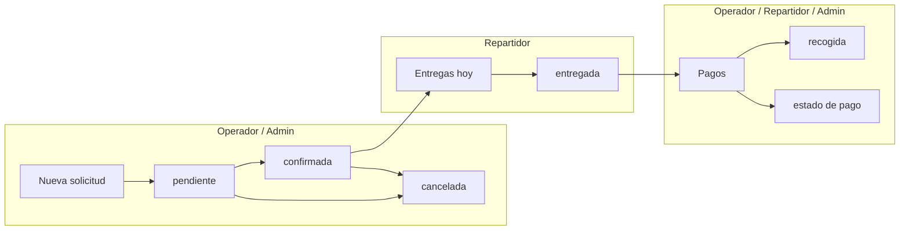

# LavaMax — Gestión de alquiler de lavadoras

Aplicación web para gestionar solicitudes de alquiler de lavadoras. Frontend en **HTML/CSS/JavaScript** (sin framework), despliegue en **GitHub Pages** y persistencia en **Google Sheets** mediante **Google Apps Script**, con **modo prueba** local en `localStorage`.

---

## Resumen de funcionalidades

| Área | Descripción |
|------|-------------|
| **Autenticación** | Ingreso con PIN por usuario; menú y rutas filtrados por rol |
| **Órdenes** | Listado, filtros y cambio de gestión (`pendiente` / `confirmada` / `cancelada`) |
| **Nueva solicitud** | Alta de clientes, entrega, lavadora (autocompletado) y tarifa |
| **Entregas hoy** | Órdenes con entrega programada para el día actual |
| **Pagos** | Cobros y cierre de gestión al recoger (`entregada` → `recogida`) |
| **Administración** | Inventario, tarifas, usuarios (PIN/rol), reportes financieros |
| **Modo prueba** | Datos de ejemplo sin Google Sheets; PINs de demostración |

---

## Roles y casos de uso

Hay tres roles: `admin`, `operador` y `repartidor`. Cada uno ve solo las vistas de su rol en el menú lateral; si intenta abrir una ruta no permitida (por URL), la app redirige a su vista inicial.

### Matriz de acceso

| Vista / Ruta | Admin | Operador | Repartidor |
|--------------|:-----:|:--------:|:----------:|
| Órdenes `#/` | ✓ | ✓ | — |
| Nueva solicitud `#/nueva` | ✓ | ✓ | — |
| Entregas hoy `#/entregas` | ✓ | — | ✓ |
| Pagos `#/pagos` | ✓ | ✓ | ✓ |
| Inventario `#/admin/inventario` | ✓ | — | — |
| Tarifas `#/admin/tarifas` | ✓ | — | — |
| Usuarios `#/admin/usuarios` | ✓ | — | — |
| Reportes `#/admin/reportes` | ✓ | — | — |
| Configuración API (menú) | ✓ | — | — |

**Vista inicial tras el login**

| Rol | Ruta por defecto |
|-----|------------------|
| Admin | `#/` (Órdenes) |
| Operador | `#/` (Órdenes) |
| Repartidor | `#/entregas` (Entregas hoy) |

### Casos de uso por rol

#### Administrador (`admin`)

- Revisar y filtrar todas las órdenes; confirmar o cancelar solicitudes nuevas.
- Crear solicitudes desde **Nueva solicitud**.
- Supervisar entregas del día y el flujo de cobros en **Pagos**.
- Gestionar inventario de lavadoras, tarifas (12 h / 24 h) y usuarios con PIN y rol.
- Consultar reportes financieros por rango de fechas (ingresos cobrados vs. por cobrar).
- Configurar la URL del API y la clave admin de Google Apps Script.
- En modo prueba: restablecer datos de ejemplo desde la barra superior.

#### Operador (`operador`)

- **Órdenes**: ver solicitudes ordenadas por proximidad de entrega; marcar como `pendiente`, `confirmada` o `cancelada` (solo en esos estados editables).
- **Nueva solicitud**: registrar clientes, dirección, fecha/hora de entrega, lavadora disponible y tarifa.
- **Pagos**: ver órdenes en ruta (`confirmada` o `entregada`); actualizar estado de pago y, si aplica, marcar `entregada` → `recogida` al cerrar la recogida.
- No ve **Entregas hoy** ni el módulo de administración.

#### Repartidor (`repartidor`)

- **Entregas hoy**: solo órdenes con `fecha_entrega` = hoy (excluye `cancelada` y `recogida`); cambiar gestión entre `pendiente`, `confirmada` y `entregada`.
- **Pagos**: mismo flujo de cobro que el operador para órdenes en ruta.
- No ve **Órdenes**, **Nueva solicitud** ni administración.

---

## Flujo operativo recomendado



1. **Operador** crea la solicitud y la deja en `pendiente` o `confirmada`.
2. **Repartidor** (o admin) en **Entregas hoy** marca `entregada` al instalar la lavadora.
3. **Operador o repartidor** en **Pagos** registra el pago y, al recoger, pasa a `recogida`.

---

## Estados de una solicitud

La app maneja **dos ejes independientes**:

### Estado de gestión (`estado`)

| Valor | Significado |
|-------|-------------|
| `pendiente` | Solicitud registrada, sin confirmar |
| `confirmada` | Confirmada para entrega |
| `entregada` | Lavadora entregada al cliente |
| `recogida` | Lavadora recogida; ciclo cerrado |
| `cancelada` | Solicitud cancelada |

**Dónde se puede cambiar cada transición**

| Vista | Estados permitidos en el selector |
|-------|-----------------------------------|
| **Órdenes** | `pendiente`, `confirmada`, `cancelada` (solo si la orden está en `pendiente` o `confirmada`; si ya está `entregada`, `recogida` o `cancelada` solo se muestra el badge) |
| **Entregas hoy** | `pendiente`, `confirmada`, `entregada` |
| **Pagos** | Gestión: solo `entregada` → `recogida` (en el modal de confirmación) |

### Estado de pago (`estado_pago`)

| Valor | Descripción |
|-------|-------------|
| `pago pendiente` | Sin cobro registrado (valor por defecto) |
| `pago efectivo` | Cobrado en efectivo (total) |
| `pago transferencia` | Cobrado por transferencia (total) |
| `pago parcial` | Abono parcial; requiere `monto_pagado` |

La vista **Pagos** lista órdenes en ruta (`confirmada` o `entregada`), ordenadas por **fecha/hora de recogida** (la más próxima primero). Los reportes del admin usan estos valores para ingresos cobrados y saldo por cobrar (COP, locale `es-CO`).

### Alquiler y fechas

- Tarifas con `horas_duracion` (12 o 24 h); en la solicitud se guarda `horas_alquiler`.
- **Recogida** = fecha/hora de entrega + duración del alquiler.
- Órdenes con entrega en menos de 24 h se marcan como **Pronto**.

---

## Autenticación (PIN)

1. Al abrir la app aparece el teclado numérico de PIN (4–6 dígitos).
2. El API valida el PIN contra la hoja **Usuarios** (`activo` = `si`).
3. La sesión se guarda en `sessionStorage` (se pierde al cerrar la pestaña).
4. **Cerrar sesión** en el pie del menú lateral.

### Usuarios en Google Sheets

Columnas de la pestaña `Usuarios`:

| Columna | Descripción |
|---------|-------------|
| `id` | Identificador |
| `nombre` | Nombre visible en la app |
| `email` | Correo |
| `rol` | `admin`, `operador` o `repartidor` |
| `pin` | PIN de acceso (4–6 dígitos) |
| `activo` | `si` / `no` |

### PINs de modo prueba (sin API configurada)

| Usuario | Rol | PIN |
|---------|-----|-----|
| Maria Admin | admin | `1111` |
| Ana Operadora | operador | `2222` |
| Carlos Repartidor | repartidor | `3333` |

---

## Arquitectura

```
GitHub Pages (index.html + js/)
        │
        ▼
Google Apps Script Web App  (/exec)
        │
        ▼
Google Sheets (Solicitudes, Inventario, Tarifas, Usuarios)
```

**Recursos del API** (parámetro `resource`):

| Recurso | Método | Notas |
|---------|--------|-------|
| `auth` | GET | Login por `pin` (sin `adminKey`) |
| `solicitudes` | GET / POST | Crear y actualizar órdenes |
| `inventario` | GET / POST | Requiere `adminKey` |
| `tarifas` | GET / POST | Requiere `adminKey` |
| `usuarios` | GET / POST | Requiere `adminKey` |
| `reportes` | GET | Requiere `adminKey`; parámetros `desde`, `hasta` |

---

## 1. Configurar Google Sheets

1. Crea una hoja de cálculo en Google Drive.
2. Pestañas (se pueden crear solas al usar el script): `Solicitudes`, `Inventario`, `Tarifas`, `Usuarios`.
3. **Extensiones → Apps Script** → pega `google-apps-script/Code.gs`.
4. Cambia `ADMIN_KEY` por una clave segura.
5. **Implementar → Nueva implementación**:
   - Tipo: **Aplicación web**
   - Ejecutar como: **Yo**
   - Acceso: **Cualquiera**
6. Copia la URL que termina en `/exec`.

### Columnas principales

**Solicitudes** (entre otras): `cliente_nombre`, `cliente_telefono`, `direccion`, `fecha_entrega`, `hora_entrega`, `lavadora_id`, `lavadora_codigo`, `horas_alquiler`, `tarifa_id`, `total`, `estado`, `estado_pago`, `monto_pagado`, `notas`.

**Inventario**: `codigo`, `modelo`, `capacidad_kg`, `estado` (`disponible`, `alquilada`, etc.).

**Tarifas**: `nombre`, `precio_dia`, `horas_duracion`, `descripcion`.

**Usuarios**: `nombre`, `email`, `rol`, `pin`, `activo`.

---

## 2. Configurar la aplicación

1. Abre la app (local o GitHub Pages).
2. Inicia sesión como **admin**.
3. Menú → **API**.
4. Pega la URL del Web App y la **clave admin** (la misma que `ADMIN_KEY` en el script).
5. Guardar.

Sin URL configurada, la app funciona en **modo prueba** con datos en `localStorage`.

---

## 3. Desplegar en GitHub Pages

### Probar en local

```bash
cd gestion-lavadoras
npx serve .
# o: python3 -m http.server 8080
```

Abre `http://localhost:8080`. **No abras** `index.html` con `file://`; los módulos ES no cargan.

### Publicar

1. Sube el proyecto a un repositorio de GitHub.
2. **Settings → Pages**: rama `main`, carpeta raíz (o `/docs` si aplica).
3. Incluye `.nojekyll` en la raíz para que Jekyll no bloquee rutas con `_`.

---

## Modo prueba (sin Google Sheets)

- Se activa automáticamente si no hay URL del API guardada.
- Datos en `js/mock-data.js`, persistidos en `localStorage` (`lavarent_mock_store`).
- Banner **Modo prueba** y botón **Restablecer** (solo **admin**).
- Al configurar la URL del API en **API**, la app pasa a usar Google Sheets.

---

## Estructura del proyecto

```
gestion-lavadoras/
├── index.html              # Shell, menú, modales, login PIN
├── css/styles.css
├── js/
│   ├── app.js              # Router hash, sesión, navegación
│   ├── auth.js             # Roles, permisos, menú por rol
│   ├── api.js              # Cliente API / mock
│   ├── mock-data.js        # Datos locales y emulación del API
│   ├── estados.js          # Reglas de estados de gestión
│   ├── finanzas.js         # Estados de pago y reportes
│   ├── alquiler.js         # Horas, recogida, ordenamiento
│   └── views/
│       ├── login.js        # Pantalla PIN
│       ├── ordenes.js
│       ├── nueva-solicitud.js
│       ├── entregas.js
│       ├── pagos.js
│       └── admin.js        # Inventario, tarifas, usuarios, reportes
├── google-apps-script/
│   └── Code.gs
└── .nojekyll
```

---

## Rutas de la aplicación

| Hash | Vista |
|------|-------|
| `#/` | Órdenes de solicitud |
| `#/nueva` | Nueva solicitud |
| `#/entregas` | Entregas del día |
| `#/pagos` | Estado de pagos |
| `#/admin/inventario` | Inventario |
| `#/admin/tarifas` | Tarifas |
| `#/admin/usuarios` | Usuarios y PINs |
| `#/admin/reportes` | Reportes financieros |

---

## Seguridad

| Medida | Detalle |
|--------|---------|
| PIN por usuario | Validado en el API (`resource=auth`); no expone la lista de usuarios al cliente |
| Sesión | `sessionStorage`; cerrar pestaña = cerrar sesión |
| Menú y rutas | Filtrados por rol en cliente; rutas no permitidas redirigen con aviso |
| Admin API | Inventario, tarifas, usuarios y reportes requieren `adminKey` en cada petición |
| Crear solicitudes | El endpoint de solicitudes no exige `adminKey` (pensado para captación desde la web) |

Para entornos más exigentes: restringir el despliegue del Web App, usar HTTPS en Pages y rotar PINs/claves periódicamente.

---

## Solución de problemas

| Problema | Solución |
|----------|----------|
| PIN correcto pero no entra | Usuario con `activo` = `si` y columna `pin` en la hoja; en modo prueba usa los PINs de la tabla anterior |
| El menú muestra vistas de otro rol | Cierra sesión y vuelve a entrar; recarga con Ctrl/Cmd+Shift+R |
| La pantalla de PIN no desaparece | Recarga forzada; verifica que sirves por HTTP, no `file://` |
| CORS / no carga datos | Web App desplegada con acceso **Cualquiera** |
| Clave inválida en admin | Misma `ADMIN_KEY` en el script y en **API** de la app |
| Página en blanco en Pages | Archivo `.nojekyll` en la raíz del sitio |
| Módulos no cargan en local | `npx serve .` o `python3 -m http.server` |
| Órdenes antiguas sin PIN | En modo prueba: **Restablecer** o agregar columna `pin` y valores en Usuarios |

---

## Licencia y soporte

Proyecto de uso interno para gestión de alquiler de lavadoras. Ajusta `ADMIN_KEY`, PINs y usuarios en producción antes de exponer la URL pública.
